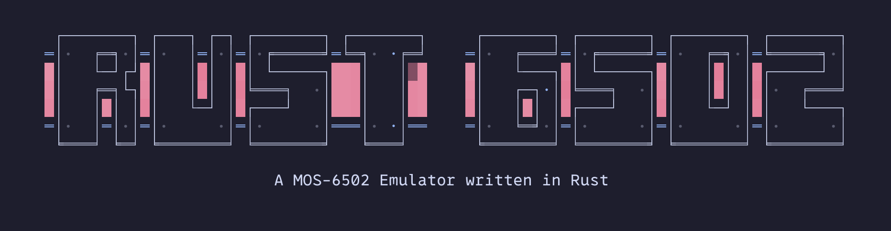
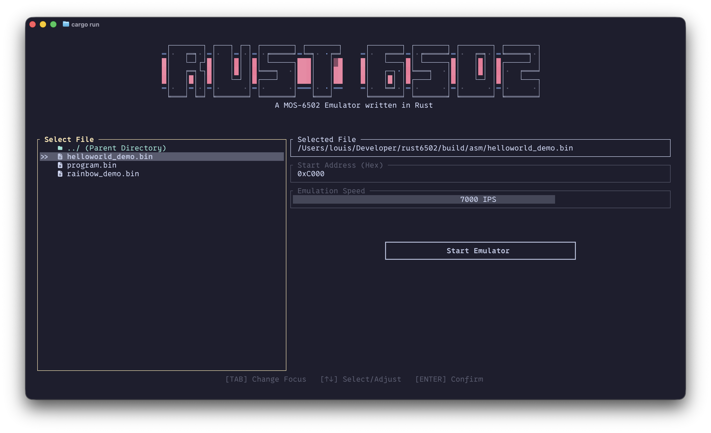
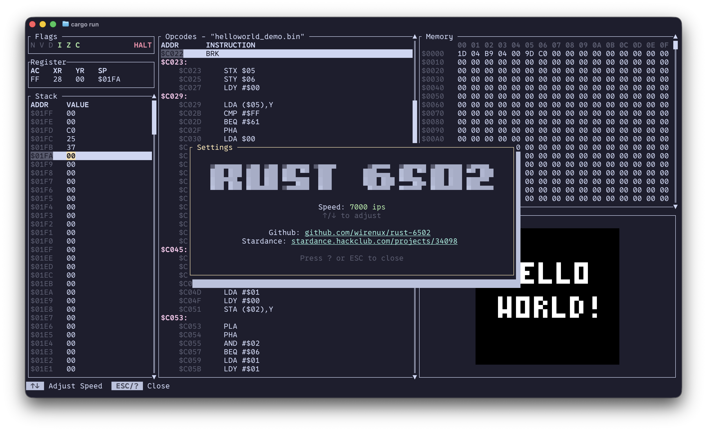
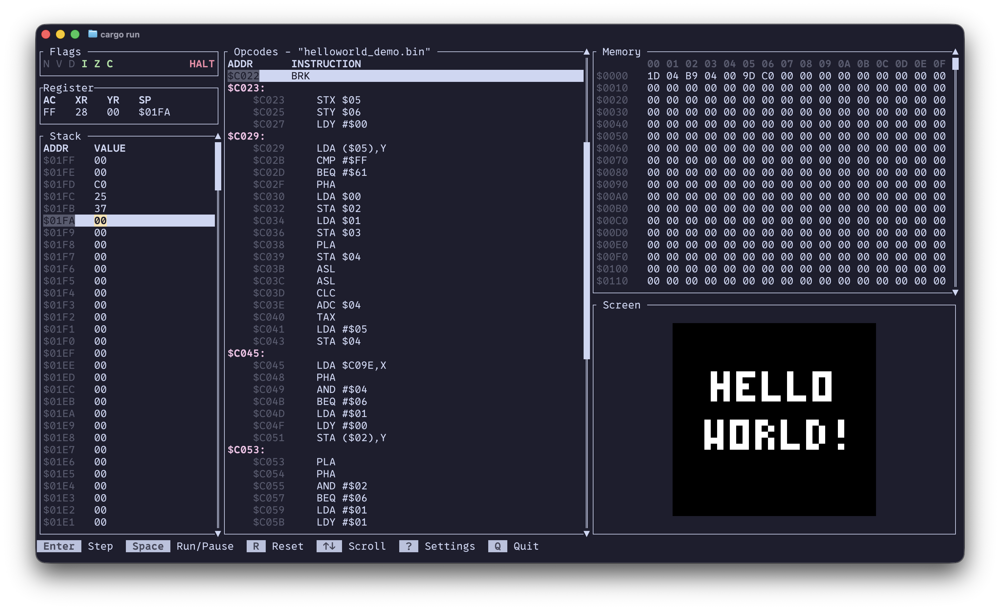
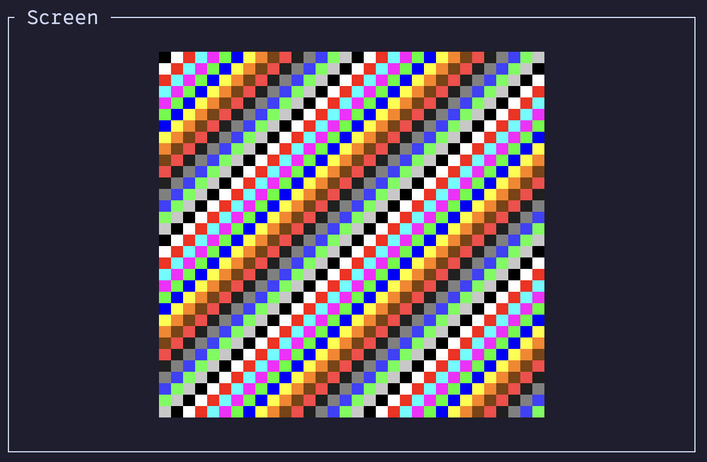
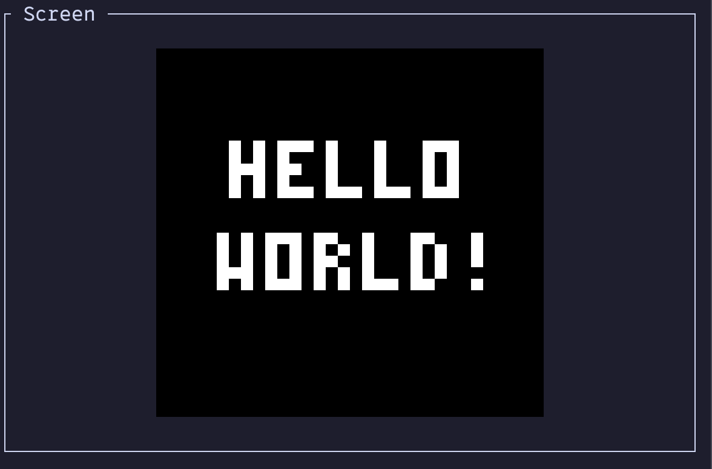
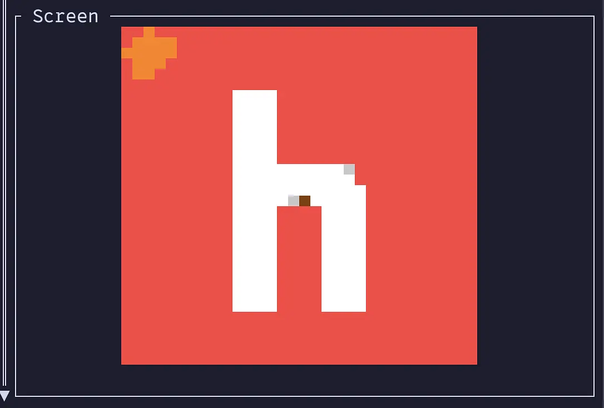

<p align="center">
    
    
    
    
    
    <br />
    A <a href="https://en.wikipedia.org/wiki/MOS_Technology_6502">MOS 6502 CPU</a> emulator build in Rust
</p>

---

> [!NOTE]
> A Nerd Font is strongly recommended in your terminal emulator for proper rendering of UI icons.

## What is the MOS 6502

> The MOS 6502 is an 8-bit microprocessor that was designed by a small team led by Chuck Peddle for MOS Technology [...].
>
> When it was introduced, the 6502 was the **least expensive microprocessor on the market** by a considerable margin. It initially sold for less than one-sixth the cost of competing designs from larger companies, such as the 6800 or Intel 8080. Its introduction caused rapid decreases in pricing across the entire processor market. **Along with the Zilog Z80, it sparked a series of projects that resulted in the home computer revolution of the early 1980s**.

Source: [Wikipedia](https://en.wikipedia.org/wiki/MOS_Technology_6502)

---

<table align="center" border="0">
  <tr>
    <td colspan="4" align="center">
      <br>
      <sub><b>Home</b></sub>
    </td>
    <td colspan="4" align="center">
      <br>
      <sub><b>Settings</b></sub>
    </td>
  </tr>

  <tr>
    <td colspan="6" align="center">
      <br>
      <sub><b>Running</b></sub>
    </td>
  </tr>
</table>

## Core Features

### Emulator

* **Virtual Screen**: A 32x32 pixel screen using the Unicode half-block character `▀` with a custom color palette.
  * **Color Palette**: Supports 16 custom colors. For more information, see the [Color List](./Palette.md).
* **Flags Container**: Displays the status flags ($N, V, D, I, Z, C$), highlighting active flags in bright green.
* **Register Container**: Live tracking of registers ($AC, XR, YR, SP$).
* **Stack Viewer**: A scrollable list showing stack addresses and values, with the current stack pointer highlighted.
* **Memory Viewer**: A hexadecimal grid tracking system memory layout, complete with vertical scrolling.
* **Disassembly Program Viewer**: Automatically disassembles loaded ROM bytes into opcodes and functions (with indented code and labeled addresses). Includes a scrollbar.
* **Settings Menu**: Adjustable CPU speed settings and repository links.
* **Footer Bar**: Quick reference guide for keyboard shortcuts and controls.

### Home Menu

* **File Browser**: Lists files and folders present in the current directory, enhanced with Nerd Font icons.
* **Start Address**: Automatically detects files ending with `_demo.bin` and configures the start address to `0xC000`.
* **Emulation Speed**: Adjusts the instructions-per-second (IPS) target.

## Built with...

This project was built to help me learn Rust while using my emulator knowledge. Here is wh

* [Rust](https://rust-lang.org/): for the whole app ! `ദ്ദി(˵ •̀ ᴗ - ˵ ) ✧`
* [Ratatui](https://ratatui.rs/): to create a nice looking TUI
* [ca65](https://cc65.github.io/doc/ca65.html): to compile the ASM code
* [ld65](https://cc65.github.io/doc/ld65.html): to link the `.o` file into a `.bin` file

## What to do when testing ?

To test and run programs on the emulator, you can boot it with the demo 6502 assembly code.

*(Require to clone the repository)*

1. **Launch the Emulator:**

```bash
cargo run
```

2. **Using the Home Menu**: Navigate in the file browser into `"build/asm/"` and select a ROM, and press Start `ദ്ദി(˵ •̀ ᴗ - ˵ ) ✧`

## Implemented Demo Programs:

### Rainbow



### Hello World !



### Hackclub Logo



## Stardance Devlogs ᕙ( •̀ ᗜ •́ )ᕗ

On [Stardance](https://stardance.hackclub.com/) you can watch the full development process via all the devlogs I've created here: [Rust 6502 Devlogs](https://stardance.hackclub.com/projects/34098)

## Development

> [!IMPORTANT]
> You must have [Rust](https://rust-lang.org/) and [Cargo](https://doc.rust-lang.org/cargo/) installed on your computer

### Dependencies

* [Ratatui](https://ratatui.rs/)
* [`std` modules](https://doc.rust-lang.org/std/)
* [Crossterm](https://docs.rs/crossterm/latest/crossterm/)

### Building Rust-6502

* Clone the repository with

```bash
git clone https://github.com/wirenux/Rust-6502.git
cd Rust-6502
```

* Then install the dependencies and run the program with:

```bash
cargo run
```

### Download Rust-6502

* Download and install it with `cargo`:

TODO: publish to cargo
```bash
cargo install TODO
```

## Test & Validation

To build custom assembly files without error (handling proper memory origin segments and interrupts), it is recommended to use the [`cc65` toolchain](https://cc65.github.io/) ([`ca65`](https://cc65.github.io/doc/ca65.html) for assembly and [`ld65`](https://cc65.github.io/doc/ld65.html) for linking):

```bash
ca65 program.s -o program.o
ld65 program.o -C linker.cfg -o program.bin
```

To verify instruction behavior and debugging assembly routines I have used the [Masswerk 6502 Assembler & Emulator](https://masswerk.at/6502/)

## Documentation

For more information about the emulator subsystem, check out the dedicated documentation:

* **[Screen Documentation](./Screen.md)**: Details on the memory-mapped video buffer, resolution, and pixel rendering.
* **[Color Palette](./Palette.md)**: Reference guide for the 16 custom display colors.

## Boring Stuff

### Use of AI

* Writing small ASM programs during development to test CPU behavior and brainstorming.

### Credits

This project is created by [@wirenux](https://github.com/wirenux) in [Rust](https://rust-lang.org/) and use [Ratatui](https://ratatui.rs/).

### License

This project is release under the [MIT License](./LICENSE).